# CocoaCompose

Collection of Cocoa controls that look just right, offer modern Swift APIs, and nicely compose together.

[](https://swiftpackageindex.com/PasiSalenius/CocoaCompose)
[](https://swiftpackageindex.com/PasiSalenius/CocoaCompose)
[](https://github.com/PasiSalenius/CocoaCompose/actions/workflows/build_and_test.yml)
[](https://infosec.exchange/@pasi)

CocoaCompose was built to make it easier to develop [Proxygen](https://freshbits.fi/apps/proxygen/) Mac app, a HTTP proxy tool for testing apps and debugging remote API endpoints.

<a href="https://apps.apple.com/us/app/proxygen/id1602229284" target="_blank">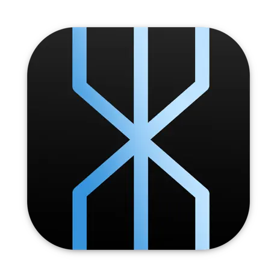</a>

<a href="https://apps.apple.com/us/app/proxygen/id1602229284" target="_blank"></a>

## Usage

Add CocoaCompose in Xcode under Project > Package Dependencies.

Then import it as shown below:

```swift
import CocoaCompose
```

## Components

CocoaCompose includes these components
- [Box](https://github.com/PasiSalenius/CocoaCompose#box)
- [Button](https://github.com/PasiSalenius/CocoaCompose#button)
- [CalendarPicker](https://github.com/PasiSalenius/CocoaCompose#calendarpicker)
- [Checkbox](https://github.com/PasiSalenius/CocoaCompose#checkbox)
- [ClockPicker](https://github.com/PasiSalenius/CocoaCompose#clockpicker)
- [ColorWell](https://github.com/PasiSalenius/CocoaCompose#colorwell)
- [DatePicker](https://github.com/PasiSalenius/CocoaCompose#datepicker)
- [FontPicker](https://github.com/PasiSalenius/CocoaCompose#fontpicker)
- [Image](https://github.com/PasiSalenius/CocoaCompose#image)
- [Label](https://github.com/PasiSalenius/CocoaCompose#label)
- [Level](https://github.com/PasiSalenius/CocoaCompose#level)
- [PopUp](https://github.com/PasiSalenius/CocoaCompose#popup)
- [Radio](https://github.com/PasiSalenius/CocoaCompose#radio)
- [Separator](https://github.com/PasiSalenius/CocoaCompose#separator)
- [Slider](https://github.com/PasiSalenius/CocoaCompose#slider)
- [ScrollView](https://github.com/PasiSalenius/CocoaCompose#scrollview)
- [Switch](https://github.com/PasiSalenius/CocoaCompose#switch)
- [Tabs](https://github.com/PasiSalenius/CocoaCompose#tabs)
- [TextField](https://github.com/PasiSalenius/CocoaCompose#textfield)
- [TextView](https://github.com/PasiSalenius/CocoaCompose#textview)
- [TimePicker](https://github.com/PasiSalenius/CocoaCompose#timepicker)

The following wrappers help lay out content in preference windows
- [PreferenceList](https://github.com/PasiSalenius/CocoaCompose#preferencelist)
- [PreferenceSection](https://github.com/PasiSalenius/CocoaCompose#preferencesection)
- [PreferenceBlock](https://github.com/PasiSalenius/CocoaCompose#preferenceblock)
- [PreferenceGroup](https://github.com/PasiSalenius/CocoaCompose#preferencegroup)

All of the components are configured to look right in a Mac app out of the box, and come with easy to use initialisers, and take a closure for value changes. All components are set to dynamic type `NSFont.TextStyle.body` by default.

### Box

`Box` combines a title label and a gray colored wrapper view.

```swift
let box = Box(title: "Title", orientation: .vertical, views: [
    ...
])
```

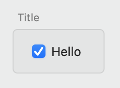

### Button

Basic `NSButton` with `bezelStyle` set to `.rounded`. It can be configured with a title and an optional image with a symbol configuration.

```swift
let image = NSImage(systemSymbolName: "checkmark.seal.fill", accessibilityDescription: nil)
let configuration = NSImage.SymbolConfiguration(paletteColors: [.white, .systemGreen])

let button = Button(title: "Click Me", image: image, symbolConfiguration: configuration) {
    // do something here ...
}
```


### CalendarPicker

`CalendarPicker` is an `NSDatePicker` with `datePickerStyle` set to `.clockAndCalendar` and `datePickerElements` configured to either `.yearMonthDay`.

Configure it with a `date`, `minDate` and `maxDate`.

```swift
let picker = CalendarPicker(date: .now) { date in
    // do something here ...
}
```

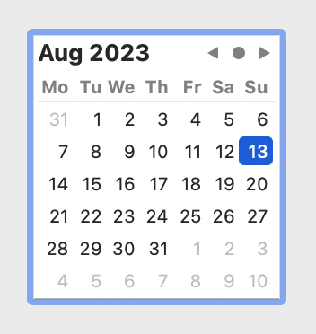

### Checkbox

`Checkbox` is an `NSButton` with `buttonType` set to `.switch`. It takes a title and simple boolean for checked state. 

```swift
let checkbox = Checkbox(title: "Select something", isOn: true) { enabled in
    // do something here ...
}
```

Access its checked status using `isOn` property.

```swift
let checked = checkbox.isOn
```

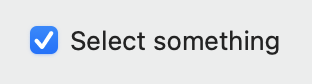

### ClockPicker

`ClockPicker` is an `NSDatePicker` with `datePickerStyle` set to `.clockAndCalendar` and `datePickerElements` configured to either `.hourMinuteSecond` or `.hourMinute`. Initialise it with a `date`, `minDate` and `maxDate`.

```swift
let picker = ClockPicker(date: .now) { date in
    // do something here ...
}

picker.showSeconds = true
```

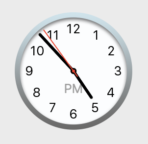

### ColorWell

`NSColorWell` with `colorWellStyle` set to `.default`, `.minimal` or `.expanded`. Configure it with a `color` value. Note that the additional style options are only available in macOS 13.0 and later.

```swift
let colorWell = ColorWell(color: .blue) { color in
    // do something here ...
}
```

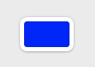

### DatePicker

`DatePicker` is an `NSDatePicker` with `datePickerStyle` set to `.textFieldAndStepper` or `.textField` and `datePickerElements` configured to either `.yearMonthDay` or `.yearMonth`. Initialise it with a `date`, `minDate` and `maxDate`.

```swift
let picker = DatePicker(date: .now) { date in
    // do something here ...
}
```

Show stepper for the picker.

```swift
picker.showStepper = true
```

Show days for the picker.

```swift
picker.showDays = true
```

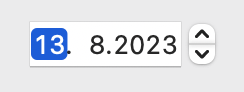

### FontPicker

`FontPicker` is an `NSButton` that uses `NSFontPanel` and `NSFontManager` to show the font selection panel. Initialise it with a `font` and optional title.

If button title is not set, the current font display name will be shown using the currently selected font.

```swift
let picker = FontPicker(font: myFont) { font in
    // do something here ...
}
```

Update selected font.

```swift
picker.selectedFont = .preferredFont(forTextStyle: .body)
```

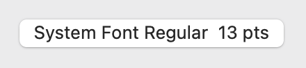

### Image

`Image` is an `NSImageView` with an optional `onClick` handler and `CGSize`.

```swift
let view = Image(image: myImage)
let view = Image(named: "App Icon")
let view = Image(systemSymbolName: "tortoise")
```

### Label

`Label` is an `NSTextField` with background and border drawing disabled. It also takes an `NSAttributedString` as value.

```swift
let label = Label(string: "Hello")
label.stringValue = "Hello world!"
```

### Level

`Level` is an `NSLevelIndicator` with `levelIndicatorStyle` set to `.continuousCapacity`. Initialise it with a `value`, `minValue` and `maxValue`.

```swift
let level = Level(value: 0.3, minValue: 0, maxValue: 1) { value in
    // do something here ...
}
```

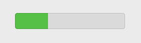

### PopUp

`PopUp` combines a `NSPopUpButton` and an optional trailing text label into one control. Set it up using an array of items, that have a title and an optional `NSImage`, and a currently selected index. For no selection use `selectedIndex` value -1. 

```swift
let popup = PopUp(items: [PopUp.Item(title: "Orange", image: image)] }, selectedIndex: 0, trailingText: "flag") { item in
    // do something here ...
}
```

Set a callback for a changed selection.

```swift
popup.onChange = { item in
    // do something here ...
}
```

Configure its items and selected item.

```swift
popup.items = ["One", "Two", "Three"].map { .init(title: $0) }
popup.selectedIndex = 1
```

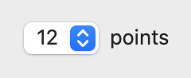

### Radio

`Radio` is a vertical stack of `NSButton` controls with `buttonType` set to `.radio`. Initialise this component with an optional `selectedIndex` parameter, where -1 indicates no selection.

You can append a horizontal stack of views after the radio item, to combine this option with other controls, such as a `TextField`. These trailing views are automatically enabled for the currently selected item and disabled for other items.

```swift
let radio = Radio(items: [
    Radio.Item(title: "First"),
    Radio.Item(title: "Second", views: [
        TextField(value: "30", trailingText: "seconds") { text in
            // do something here ...
        },
    ])
    
], selectedIndex: 0) { index, previousIndex in
    // do something here ...
}
```

Configure its selected item.

```swift
radio.selectedIndex = 1
```

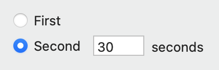

### ScrollView

`ScrollView` is an `NSScrollView` that sets an `NSClipView` as its `contentView` and a stack of views as its `documentView`. The stack automatically uses the appropriate system spacing.

It defaults to only scrolling vertically. Setting `orientation: .horizontal` will switch both its item stack orientation and scrolling direction to horizontal.

```swift
ScrollView(orientation: .vertical, views: [
    ...
])
```

### Separator

`Separator` is an `NSBox` with its `boxType` set to `.separator`. 

Use separators between sections of options in a preferences window.

```swift
let separator = Separator()
```

### Slider

`Slider` is an `NSSlider` with `sliderType` set to `.linear`. Initialise it with a `value`, `minValue` and `maxValue`.

```swift
let slider = Slider(value: 0.3, minValue: 0, maxValue: 1) { value in
    // do something here ...
}
```

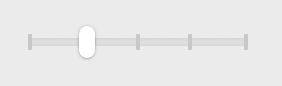

### Switch

`Switch` is an `NSSwitch`. Set it up using `isOn` value.

```swift
let switch = Switch(isOn: true) { isOn in
    // do something here ...
}
```

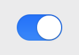

### Tabs

`Tabs` combines an `NSSegmentedControl` with a list of `Tabs.Item`. It automatically displays the item at the selected index.

```swift
let tabs = Tabs(selectedIndex: 0, items: [
    .init(title: "URI", views: [
        ...
    ]),
    .init(title: "Headers", views: [
        ...
    ]),
    .init(title: "Body", views: [
        ...
    ])
]) { index in
    ...
}
```

Access its selected index using the following property.

```swift
tabs.selectedIndex = 2
```

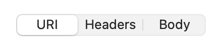

### TextField

`TextField` is an `NSTextField` with an optional trailing `Label`. You should configure it with a `width` that fits your use case nicely.

```swift
let textField = TextField(value: "30", trailingText: "seconds") { text in
    // do something here ...
}
```

Configure its value or placeholder string.

```swift
textField.stringValue = "50"
textField.placeholder = "Enter name"
```

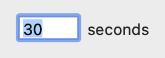

### TextView

`TextView` is an `NSScrollView` with an `NSTextView` as a document view. It is set up with data detectors and spelling corrections disabled.

```swift
let textView = TextView(text: "Example text") { text in
    // do something here ...
}
```

Configure its text and font and control whether editing is allowed.

```swift
textField.text = "Another text"
textField.font = .monospacedSystemFont(ofSize: 12, weight: .regular)
textField.isEditable = false
```

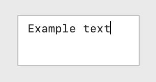

### TimePicker

`TimePicker` is an `NSDatePicker` with `datePickerStyle` set to `.textFieldAndStepper` or `.textField` and `datePickerElements` configured to either `.hourMinuteSecond` or `.hourMinute`. Initialise it with a `date`, `minDate` and `maxDate`.

```swift
let picker = TimePicker(date: .now) { date in
    // do something here ...
}
```

Show stepper for the picker.

```swift
picker.showStepper = true
```

Show seconds for the picker.

```swift
picker.showSeconds = true
```

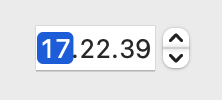

## Composing components together

Components can be composed together using compact code, that closely matches the hierarchy of the visual end result.

We use two more components to initialise the content for a Mac preference window.

### PreferenceList

`PreferenceList` takes in a list of sections and takes care of appropriate spacing between them.

Basically the only special sauce in `PreferenceList` is that it looks for leading titles labels in its views, and constrains them all to same width. This results in the familiar clean look of a Mac app preferences window (before the horror of Settings in Ventura).

Set it up with a `PreferenceList.Style` to either center contents horizontally (preference window contents are typically centered) or expand contents to full width. 

```swift
PreferenceList(views: [
    ...
])
``` 

### PreferenceSection

`PreferenceSection` takes a title, a list of components, and shows an optional footer text below all of the components in that section. The section title is shown to the left from the section components, right aligned. The title text should end with a colon.

The views in the section can be placed horizontally with `orientation: .horizontal`. 

```swift
PreferenceSection(
    title: "Options:",
    footer: "This text appears below the section.",
    orientation: .vertical,
    views: [
        ...
    ]
)
```

### PreferenceBlock

As an alternative to `PreferenceSection`, if you need a left aligned title above the components, use a `PreferenceBlock` with optional footer text below. Also here the title text should end with a colon. This layout fits with option windows whose contents fill the window horizontally.

The views in the section can be placed horizontally with `orientation: .horizontal`. 

```swift
PreferenceBlock(
    title: "Options:",
    footer: "This text appears below the block.",
    orientation: .vertical,
    views: [
        ...
    ]
)
```

### PreferenceGroup

`PreferenceGroup` takes in a list of items that each have a title and horizontal stack of views.

It is useful for creating a list of options that all have their own titles, such as `PopUp` or `TextField` components.  

```swift
PreferenceGroup(items: [
    .init(title: "First:", views: [...]),
    .init(title: "Second:", views: [...]),
])
``` 

### Example

The following example initialises a preferences window using `PreferenceList` containing multiple `PreferenceSection` that each have their own components.

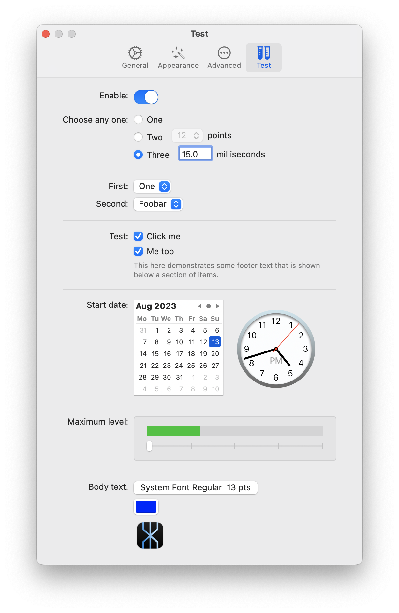 

```swift
override func loadView() {
    view = NSView()
    view.wantsLayer = true
    
    title = "Test"
    
    let list = PreferenceList(style: .center, views: [
        PreferenceSection(title: "Enable:", views: [
            Switch(isOn: true) { isOn in
                
            },
        ]),
        PreferenceSection(title: "Choose any one:", views: [
            Radio(items: [
                .init(title: "One"),
                .init(title: "Two", views: [
                    PopUp(items: ["12", "13"].map { .init(title: $0) }, selectedIndex: 0, trailingText: "points") { index, title in
                        
                    }
                ]),
                .init(title: "Three", views: [
                    TextField(value: "15.0", trailingText: "milliseconds", width: 50) { text in
                        
                    }
                ])], selectedIndex: 0) { index, previousIndex in
                    
                },
        ]),
        Separator(),
        PreferenceGroup(items: [
            .init(title: "First:", views: [
                PopUp(items: ["One", "Two"].map { .init(title: $0) }, selectedIndex: 0) { index, title in
                    
                }
            ]),
            .init(title: "Second:", views: [
                PopUp(items: ["Foobar", "Plop"].map { .init(title: $0) }, selectedIndex: 0) { index, title in
                    
                }
            ]),
        ]),
        Separator(),
        PreferenceSection(title: "Test:", footer: "This here demonstrates some footer text that is shown below a section of items.", views: [
            Checkbox(title: "Click me", isOn: true) { enabled in
                
            },
            Checkbox(title: "Me too", isOn: true) { enabled in
                
            },
        ]),
        Separator(),
        PreferenceSection(title: "Start date:", orientation: .horizontal, alignment: .centerY, spacing: 20, views: [
            CalendarPicker() { date in
                
            },
            ClockPicker() { date in
                
            },
        ]),
        Separator(),
        PreferenceSection(title: "Maximum level:", views: [
            Box(views: [
                Level(value: 0.3) { value in
                    
                },
                Slider() { value in
                    print("value changed to \(value)")
                },
            ])
        ]),
        Separator(),
        PreferenceSection(title: "Body text:", views: [
            FontPicker() { font in
                
            },
            ColorWell(color: .blue, style: .default) { color in
                
            },
            Image(named: "AppIcon Mac", size: CGSize(width: 50, height: 50)) {
                
            },
        ]),
    ])
    
    view.addSubview(list)
    list.translatesAutoresizingMaskIntoConstraints = false
    view.addConstraints([
        list.topAnchor.constraint(equalTo: view.topAnchor, constant: 20),
        list.leadingAnchor.constraint(equalTo: view.leadingAnchor, constant: 40),
        list.trailingAnchor.constraint(equalTo: view.trailingAnchor, constant: -40),
        list.bottomAnchor.constraint(lessThanOrEqualTo: view.bottomAnchor, constant: -20)
    ])
    
    preferredContentSize = CGSize(width: 500, height: view.fittingSize.height)
}
```
