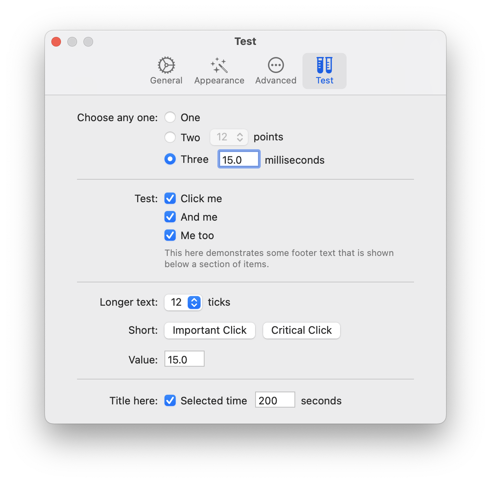

# CocoaCompose

Collection of Cocoa controls that look just right, offer modern Swift APIs, and nicely compose together.

[](https://swiftpackageindex.com/PasiSalenius/CocoaCompose)
[](https://swiftpackageindex.com/PasiSalenius/CocoaCompose)
[](https://github.com/PasiSalenius/CocoaCompose/actions/workflows/build_and_test.yml)
[](https://infosec.exchange/@pasi)

CocoaCompose was built to make it easier develop [Proxygen](https://freshbits.fi/apps/proxygen/) Mac app, a HTTP proxy tool for testing apps and debugging remote API endpoints.

<a href="https://apps.apple.com/us/app/proxygen/id1602229284" target="_blank"></a>

<a href="https://apps.apple.com/us/app/proxygen/id1602229284" target="_blank"></a>

## Usage

Add CocoaCompose in Xcode under Project > Package Dependencies.

Then import it as shown below:

```swift
import CocoaCompose
```

## Components

CocoaCompose includes these components
- [Button](https://github.com/PasiSalenius/CocoaCompose#button)
- [Checkbox](https://github.com/PasiSalenius/CocoaCompose#checkbox)
- [Label](https://github.com/PasiSalenius/CocoaCompose#label)
- [PopUp](https://github.com/PasiSalenius/CocoaCompose#popup)
- [Radio](https://github.com/PasiSalenius/CocoaCompose#radio)
- [TextField](https://github.com/PasiSalenius/CocoaCompose#textfield)
- [Separator](https://github.com/PasiSalenius/CocoaCompose#separator)

The following two components help build preference window content
- [PreferenceList](https://github.com/PasiSalenius/CocoaCompose#preferencelist)
- [PreferenceSection](https://github.com/PasiSalenius/CocoaCompose#preferencesection)

All components are set to dynamic type `NSFont.TextStyle.body` by default.

### Button

Basic `NSButton` with `bezelStyle` set to `.rounded`. It can be configured with a title and an optional image with its symbol configuration.

```swift
let image = NSImage(systemSymbolName: "checkmark.seal.fill", accessibilityDescription: nil)
let configuration = NSImage.SymbolConfiguration(paletteColors: [.white, .systemGreen])

let button = Button(title: "Click Me", image: image, symbolConfiguration: configuration) {
    // do something here ...
}
```


### Checkbox

`Checkbox` is an `NSButton` with `buttonType` set to `.switch`. It takes a title and simple boolean for checked status. 

```swift
let checkbox = Checkbox(title: "Select something", on: true) { enabled in
    // do something here ...
}
```

Configure its checked status using `set(on: Bool)` method.

```swift
checkbox.set(on: false)
```


### Label

`Label` uses `NSTextField` with background and border drawing disabled.

```swift
let label = Label(string: "Hello")
label.stringValue = "Hello world!"
```

### PopUp

`PopUp` combines a `NSPopUpButton` and an optional trailing text label into one easy to use control. Set it up using an array of `String` values and a currently selected index. For no selection use `selectedIndex` value -1. 

```swift
let popup = PopUp(items: ["10", "11", "12"], selectedIndex: 2, text: "points") { item in
    // do something here ...
}
```

Set a callback for a changed selection.

```swift
popup.onChange = { item in
    // do something here ...
}
```

Configure its items and selected item.

```swift
popup.set(items: ["One", "Two", "Three"], selectedIndex: -1)
```


### Radio

`Radio` is a vertical stack of `NSButton` controls with `buttonType` set to `.radio`. Initialise the component with an optional `selectedIndex` parameter, where -1 indicates no selection.

You can append a horizontal stack of views after the radio item, to combine this option with other controls, such as a `TextField`. These trailing views are automatically enabled only for the currently selected item and disabled for other items.

```swift
let radio = Radio(items: [
    Radio.Item(title: "First"),
    Radio.Item(title: "Second", views: [
        TextField(value: "30", text: "seconds") { text in
            // do something here ...
        },
    ])
    
], selectedIndex: 0) { index in
    // do something here ...
}
```

Configure its selected item.

```swift
radio.set(selectedIndex: 2)
```


### TextField

`TextField` is an `NSTextField` with an optional trailing `Label`.

```swift
let textField = TextField(value: "30", text: "seconds") { text in
    // do something here ...
}
```

Configure its value using the following method.

```swift
textField.set(value: "50")
```


### Separator

`Separator` can be configured to horizontal or vertical orientation. Its has partly transparent gray color and has 1 point width. 

Use separators between sections of options in a preferences window.

```swift
let separator = Separator(orientation: .horizontal)
```

## Composing components together

All of the components are configured to look right in a Mac app out of the box, and come with easy to use initialisers, and take a closure for value changes. They can be composed together using compact code, that closely matches the hierarchy of the visual end result.

We use two more components to initialise the content for this preferences window.

### PreferenceList

`PreferenceList` takes in a list of sections and takes care of appropriate spacing between them.

Basically the only special sauce in `PreferenceList` is that it looks for leading titles labels in its views, and constrains them all to same width. This results in the familiar clean look of a Mac app preferences window (before the horror of Settings in Ventura).  

```swift
PreferenceList(views: [
    ...
])
``` 

### PreferenceSection

`PreferenceSection` takes a title, a list of components, and shows an optional footer text below all of the components in that section. The section title is shown to the left from the section components, right aligned. The title text should end with a colon.

The views in the section can be places horizontally with `orientation: .horizontal`. 

```swift
PreferenceSection(
    title: "Options:",
    footer: "This text appears below a section.",
    orientation: .vertical,
    views: [
        ...
    ]
)
```

### Example

The following example initialises a preferences window using `PreferenceList` containing multiple `PreferenceSection` that each have their own components.

 

```swift
override func loadView() {
    view = NSView()
    view.wantsLayer = true

    title = "Test"
    
    let list = PreferenceList(views: [
        PreferenceSection(title: "Choose any one:", views: [
            Radio(items: [
                .init(title: "One"),
                .init(title: "Two", views: [
                    PopUp(items: ["12", "13"], selectedIndex: 0, text: "points") { item in
                        
                    }
                ]),
                .init(title: "Three", views: [
                    TextField(value: "15.0", text: "milliseconds") { text in
                
                    }
                ])], selectedIndex: 0) { index in
                
                },
        ]),
        Separator(),
        PreferenceSection(title: "Test:", footer: "This here demonstrates some footer text that is shown below a section of items.", views: [
            Checkbox(title: "Click me", on: true) { enabled in
                
            },
            Checkbox(title: "And me", on: true) { enabled in
                
            },
            Checkbox(title: "Me too", on: true) { enabled in
                
            },
        ]),
        Separator(),
        PreferenceSection(title: "Longer text:", views: [
            PopUp(items: ["12", "13"], selectedIndex: 0, text: "ticks") { item in
                
            },
        ]),
        PreferenceSection(title: "Short:", orientation: .horizontal, views: [
            Button(title: "Important Click") {
                
            },
            Button(title: "Critical Click") {
                
            },
        ]),
        PreferenceSection(title: "Value:", views: [
            TextField(value: "15.0") { text in
                
            },
        ]),
        Separator(),
        PreferenceSection(title: "Title here:", views: [
            Checkbox(title: "Selected time", on: true, views: [
                TextField(value: "200", text: "seconds") { text in
                
                }
            ], onChange: { enabled in
                
            }),
        ]),
    ])
    
    view.addSubview(list)
    list.translatesAutoresizingMaskIntoConstraints = false
    view.addConstraints([
        list.topAnchor.constraint(equalTo: view.topAnchor, constant: 20),
        list.leadingAnchor.constraint(equalTo: view.leadingAnchor, constant: 40),
        list.trailingAnchor.constraint(equalTo: view.trailingAnchor, constant: -40),
        list.bottomAnchor.constraint(lessThanOrEqualTo: view.bottomAnchor, constant: -20)
    ])

    preferredContentSize = CGSize(width: 500, height: view.fittingSize.height)
}
```
